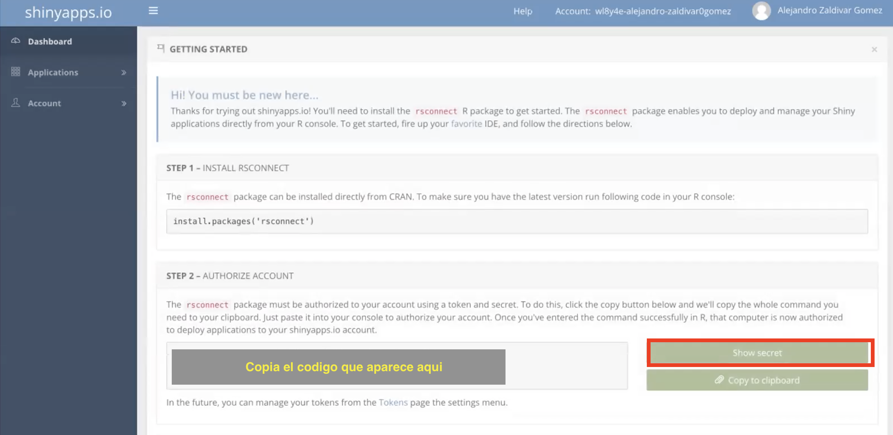

# R y R studio

Durante este workshop usaremos R y R studio:

- [Instalar R](https://cloud.r-project.org)
- [Instalar R studio](https://www.rstudio.com/products/rstudio/)

# Shiny

Shiny es la plataforma que usaremos para desarrollar nuestas aplicaciones interactivas. Shiny es una libreria de R, si aun no tienes shiny instalado, lo puedes hacer desde R como cualquier otra libreria corriendo el comando `install.package(shiny)`.  
Shiny corre localmente usando R, pero una de las caracteristicas que hacen de shiny ideal para desarrollar herramientas, es que una vez desarrollada a aplicacion, la podemos montar la aplicacion en un servidor y acceder desde cualquier computadora, celular o tablet con coneccion a internet sin necesaidad de instalar R o R studio.  

Para montar la aplicacion en un servidor necesitaremos una cuenta de [shinyapps](https://www.shinyapps.io) y autorizar R studio para montar aplicaciones en el servidor.

<!-- - https://www.shinyapps.io -->

## Crear una cuenta de shiny

Ve a la pagina principal de [shinyapps](https://www.shinyapps.io) y sigue el link que dice *sign up*:  
  

  
Puedes utilizar una cuenta de github o google para iniciar sesion  

  
Una vez que crees tu cuenta y acceses, ve a tu dashoard y sigue las instrucciones para autorizar tu cuenta en R studio. Asegurate de que en el paso 2 presiones el boton de *Show secret*, que te mostrara el codigo completo para que lo copies.

  
Para autorizar tu cuenta de shinyapps en R studio, pega el codigo en la consola de R studio, asegurate de tener instalado la libreria `rsconnect`.  

Para verificar que se haya autorizado correctamente podemos ir a *Preferencias* ya sea desde el menu superior de R studio o presionando `ctrl + ,` en windows o `cmd + ,` en Mac, y deberemos de ver nuestra cuenta autorizada en el menu de *Publishing*

Si puedes ver tu cuenta, tu entorno esta listo para empezar a desarrollar tus aplicaciones!

