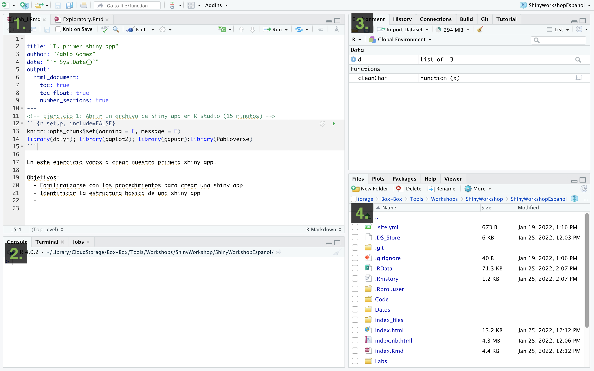
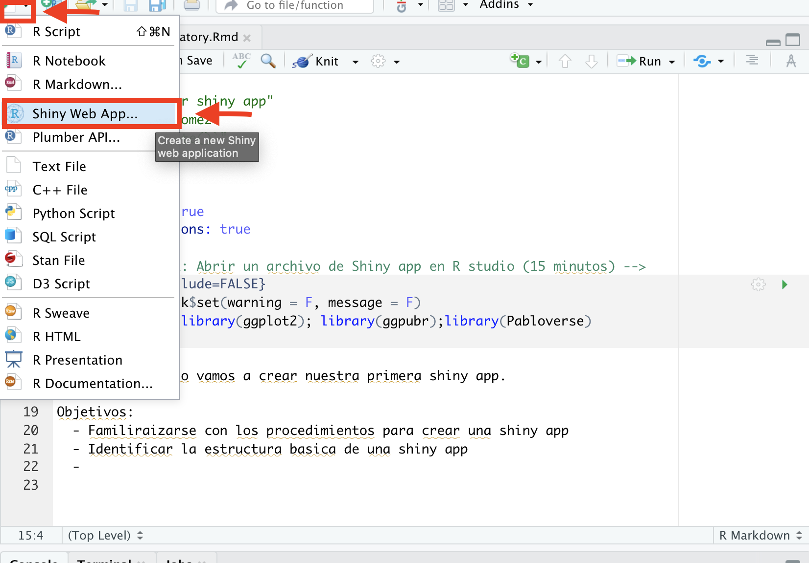
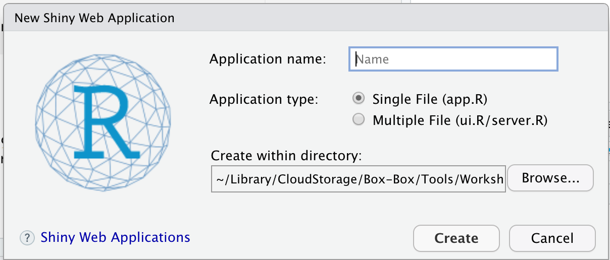
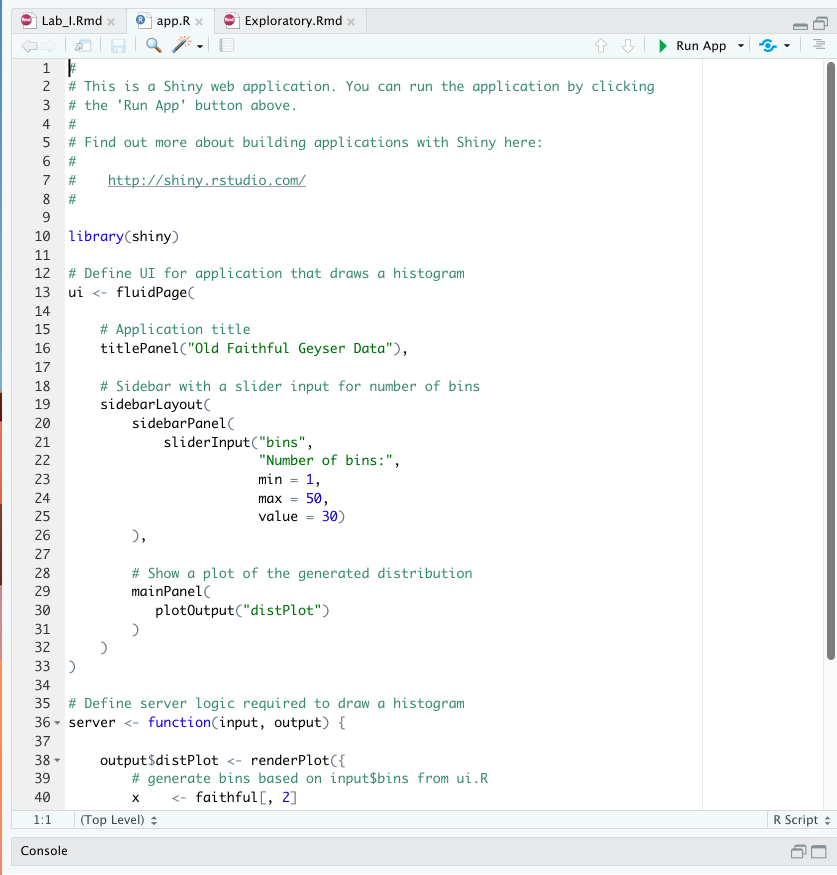

<!-- Ejercicio 1: Abrir un archivo de Shiny app en R studio (15 minutos) -->
```{r setup, include=FALSE}
knitr::opts_chunk$set(warning = F, message = F)
library(dplyr); library(ggplot2); library(ggpubr);library(Pabloverse)
```

En este ejercicio vamos a crear nuestra primera shiny app.

# Objetivos:

  - Familiraizarse con los procedimientos para crear una shiny app  
  - Identificar la estructura basica de una shiny app  
  - Correr una shiny app desde R.  

--------------------

# Interfaz de R studio

Al iniciar R studio vamos a observar 4 secciones:  

  - (1) Seccion superior derecha, en esta seccion manipulamos nuestros archivos de text que generalmente sirven para desarrollar scripts o documentos.
  - (2) Seccion inferior derecha, en esta seccion se encuentra la consola, la terminal y 'jobs'. estos tabs son en donde se envia el codigo (consola para comunicrse con R y terminal para comunicarse con tu computadora).  
  - (3) Seccion superior izquierda, en esta seccion encontraras tu environment (los objetos que has creado), el historial de comandos que has enviado a la consola y algunas otras herramientas para la organizacion del projecto.  
  - (4) Seccion inferior izquierda, en esta seccion encontraras un buscador de archivos, los graficos que hagas en R y otras opciones de ayuda.   
  


# Creando la primera aplicacion







