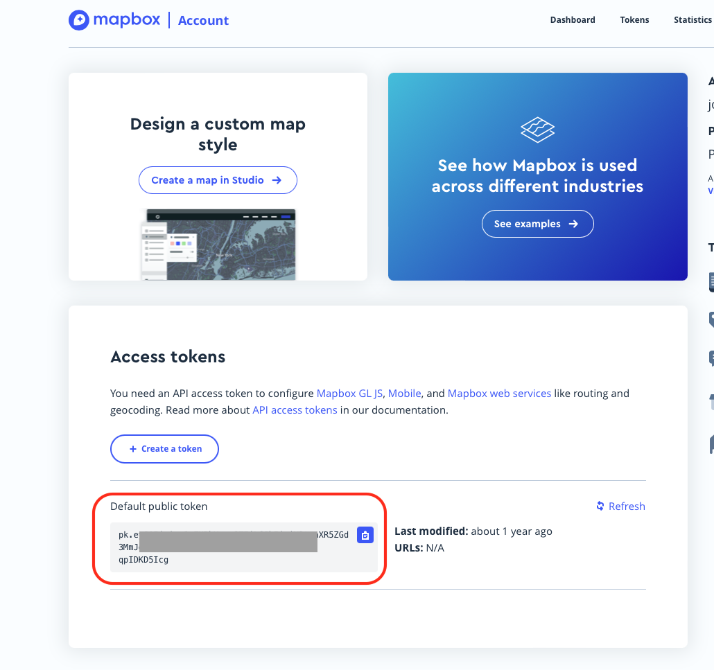

```{r include=FALSE}
knitr::opts_chunk$set(eval = T, message = F, warning = F)
```

# Introduccion

Objetivo:
En este laboratorio vamos a probar diferentes librerias para graficos interactivos

------------------------------

# Cargando nueva base de datos

Vamos a integrar una nueva base de datos para los movimientos de ganado bovino en el pais. Asegurate de tener la versio mas reciente de STNet instalada para acceder a los datos. 

```{r}
library(dplyr)
library(plotly)
library(STNet) # Cargamos la libreria
data('mov') # cargamos los datos
```


```{r}
# Primero necesitamos una tabla donde vengan las conexiones (edges)
edges <- mov %>% 
    select(ORIGEN, DESTINO, LONG_O, LAT_O, LONG_D, LAT_D) %>% 
    distinct()

# Necesitamos otra tabla que solo tenga las granjas (nodos)
nodes <- list( # primero creamos una lista con dos tablas
  n1 = distinct(edges, ID = ORIGEN, LAT = LAT_O, LONG = LONG_O), # para origenes
  n2 = distinct(edges, ID = DESTINO, LAT = LAT_D, LONG = LONG_D) # para destinos
  ) %>% 
  do.call(rbind, .) %>%  # esta funcion une las dos data.frames de la lista
  distinct() 
```


Para los siguientes mapas usaremos la libreria plotly, plotly funciona con un servicio que se llama MapBox, el cual te permite cargar mapas base para agregarlos como fondo a tus graficos. Para hacer la siguiente parte del laboratorio, es necesario tener una cuenta de [MapBox](https://account.mapbox.com)

Una vez que hagas tu cuenta, puedes acceder a tu token 



```{r include= F}
Sys.setenv('MAPBOX_TOKEN' = 'pk.eyJ1Ijoiam9zZXBhYmxvOTEiLCJhIjoiY2tsaXR5ZGd3MmJoNzJ3bWxrbTF5emw1eSJ9.THUKAPF8TYZ-qpIDKD5Icg')
```

Para introducir tu token puedes usar el siguiente codigo en R

```{r eval = F}
Sys.setenv('MAPBOX_TOKEN' = 'pega aqui tu token')
```


## Agregar Nodos
```{r}
plot_mapbox() %>% 
  add_markers(data = nodes, type = 'scatter',
              x = ~LONG, y = ~LAT, color = I('red'))
```

## Agregar segmentos

```{r}
plot_mapbox() %>% 
  add_segments(
    data = edges, alpha = 0.1, size = I(1),
    x = ~LONG_O, xend = ~LONG_D,
    y = ~LAT_O, yend = ~LAT_D
  )
```

# Layout

```{r}
plot_mapbox() %>% 
  add_segments(
    data = edges, alpha = 0.1, size = I(1),
    color = I('blue'),
    x = ~LONG_O, xend = ~LONG_D,
    y = ~LAT_O, yend = ~LAT_D
  ) %>% 
  add_markers(data = nodes, type = 'scatter',
              x = ~LONG, y = ~LAT, color = I('red')) %>% 
  layout(mapbox = list(style = 'open-street-map',
                       center = list(lon=mean(nodes$LONG), lat=mean(nodes$LAT)),
                       zoom = 3))
```


# Integrar a la app

Ahora vamos a integrar el mapa con la aplicacion.

Primero asegurate de tener las librerias necesarias cargadas

```{r include=FALSE}
knitr::opts_chunk$set(eval = F, message = F, warning = F)
```

```{r}
library(shiny)
library(dplyr) # Para manipulacion de datos
library(ggplot2) # Para las figuras
library(shinydashboard) # para crear un dashboard
library(STNet)
library(sf)
library(plotly)
```


Despues agregaremos los nuevos datos a la seccion donde los cargamos:

```{r}
data('mov') # cargamos los datos
```

Despues agregamos un nuevo tab a nuestro sidebar

```{r}
sidebar <- dashboardSidebar(
  sidebarMenu(
    # ... Otros tabs del menu
    menuItem("Movimientos", tabName = 'T4'),
    # ... resto de la aplicacion
  )
)
```

Tenemos que crear un nuevo tab para este nuevo item. EN esta nueva pagina amos a crear un input para filtrar por motivo y un output para el mapa.  

```{r}
tabItem(tabName = 'T4',
            fluidRow(
              box(title = 'Motivo', width = 12,
                  selectInput(inputId = 'Motivo', label = 'Motivo: ', 
                              multiple = T,
                              choices = unique(mov$MOTIVO), 
                              selected = unique(mov$MOTIVO))),
              box(title = 'Mapa de movimientos',
                  plotlyOutput('MovMap'))
              )
            )
```

Ahora creamos los objetos reactivos:

```{r}
# primero para filtrar los movimientos
Mov <- eventReactive(input$filter, {
    mov %>% 
      filter(MOTIVO %in% input$Motivo,
             year %in% input$year)
  })
# despues para crear los edges y Nodes
edges <- eventReactive(input$filter,{
    edges <- Mov() %>% 
      select(ORIGEN, DESTINO, LONG_O, LAT_O, LONG_D, LAT_D) %>% 
      distinct()
  })

nodes <- list(
  n1 = distinct(edges, ID = ORIGEN, LAT = LAT_O, LONG = LONG_O),
  n2 = distinct(edges, ID = DESTINO, LAT = LAT_D, LONG = LONG_D)
  ) %>% 
  do.call(rbind, .) %>% 
  distinct() 
```

Y finalmente nuestro output

```{r}
output$MovMap <- renderPlotly({
    plot_mapbox() %>% 
      add_segments(
        data = edges(), alpha = 0.1, size = I(1),
        color = I('blue'),
        x = ~LONG_O, xend = ~LONG_D,
        y = ~LAT_O, yend = ~LAT_D
      ) %>% 
      add_markers(data = nodes(), type = 'scatter',
                  x = ~LONG, y = ~LAT, color = I('red')) %>% 
      layout(mapbox = list(style = 'open-street-map',
                           center = list(lon=mean(nodes()$LONG), lat=mean(nodes()$LAT)),
                           zoom = 3))
  })
```


