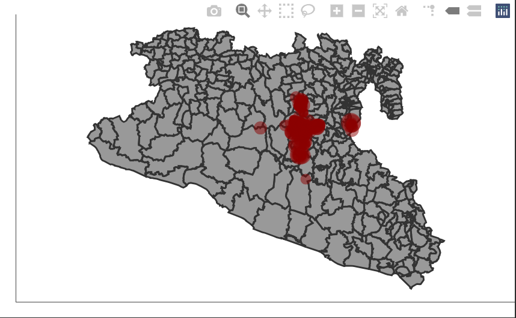

```{r include=FALSE}
knitr::opts_chunk$set(eval = T, message = F, warning = F)
```

# Introduccion

Objetivo:
En este laboratorio vamos a introducir reactividad avanzada. Vamos a trabajar con mensajes y botones para hacer mas eficiente nuestra aplicacion.

------------------------------

Vamos a continuar trabajando en la aplicacion que hemos creado, ahora vamos a enfocarnos en como mejorar la interaccion con el usuario y comunicar los procesos a nuestro servidor de manera mas eficiente.

Primero nos aseguramos de tener las librerias cargadas. En este laboratorio introduciremos dos nuevas librerias. La primera es la libreria `sf`, para manipular objetos espaciales. Y la segunda es `plotly`, para hacer graficos interactivos.  

```{r cargar librerias}
# Cargar las librerias
library(shiny)
library(dplyr) # Para manipulacion de datos
library(ggplot2) # Para las figuras
library(shinydashboard) # para crear un dashboard
library(STNet) # libreria para bases de datos
library(sf) # libreria para objetos espaciales
library(plotly) # libreria para graficos interactivos
```

# Mapas

Vamos a usar los mismos datos de STNet que hemos estado usando. Vamos a introducir una nueva base de datos que tiene los objetos espaciales. Esta nueva base de datos contiene todos los municipios de Mexico. En este laboratorio vamos a filtrar para obtener un objeto espacial del area de estudio.

```{r Cargar datos}
# asegurate de tener la version mas reciente de la libreria STNet para cargar las nuevas bases de datos
# Cargar los datos del paquete STNet
data("vac") # Datos de vacunacion
data("vigilancia") # datos de vigilancia
data("captura") # Datos de captura

# Loading the spatial data from the package
MxShp <- st_read(system.file("data/MxShp.shp", package = "STNet")) %>% 
  filter(CVE_ENT %in% c('15', '12', '16')) # filtramos la base de datos para solo usar los estados 15, 12 y 16
```
  
Ahora vamos a proyectar nuestras ubicaciones de las capturas.  
Primero transformamos nuestra tabla de capturas a un obeto espacial con la funcion `st_as_sf()`. En esta funcion hay que especificar el sistema de coordenadas inicial y los nombres de las columnas que tengan los atributos de latitud y longitud (o X y Y).  
Despues usamos la funcion `st_transform()` para proyectar nuestros datos en la misma proyeccion de la base de datos de los municipios.  

```{r}
# proyectar nuestros puntos
capturaSp <- captura %>% 
  st_as_sf(crs = st_crs(4326), coords = c('LONG', 'LATITUD')) %>% 
  st_transform(crs = st_crs(MxShp))
```

## Haciendo la figura

Vamos a planear nuestra figura ahora. La base de datos de capturas tiene el numero de animales capturados y las localizaciones por año, vamos a hacer un grafico que nos muestre los municipios, y un punto con el numero de capturas por año. 

```{r}
p <- ggplot() + # llamamos a la libreria ggplot
      geom_sf(data = MxShp, fill = 'grey60', col = 'grey20') + # ponemos nuestro mapa base
      geom_sf(data = capturaSp, aes(size = CAPTURADOS), alpha = 0.5, col = 'red4') + # agregamos nuestros puntos
      theme_void() # seleccionamos un tema sin axis ni grids

p
```
  
## Incorporandola a la aplicacion. 

### Nuevo output en la ui

```{r include=FALSE}
knitr::opts_chunk$set(eval = F, message = F, warning = F)
```

Una vez que tenemos nuestro mapa podemos incorporarlo a la aplicacion. Vamos a crear una nueva caja en la pestaña para los datos de captura (tab 'T3'):  

```{r}
tabItem(tabName = 'T3',
        fluidRow(
          column(width = 12,
                 # ... , # aqui va nuestro codigo para la figura anterior
                 box(title = 'Localizaciones de capturas', width = 6,
                     plotOutput('CapturaMap')
                     )
                 )
          )
        )
```

### Modificar evento reactivo

Podemos usar el mismo evento reactivo que teniamos anteriormente para la figura del grafico de barras haciendo unas modificaciones al codigo. Anteriormente llamabamos al objeto `capturas` para hacer el filtrado de los datos en el evento reactivo `z()`, pero ahora podemos cambiar ese objeto por nuestros datos espaciales proyectados `capturasSp` y lo podemos usar para el grafico de barras y el mapa.  

Nuestro objeto reactivo quedaria asi:

```{r}
z <- eventReactive(input$filter, {
    p <- capturaSp %>% # base de datos espaciales proyectada
      filter(NOM_MUN %in% input$Mun,
             between(YEAR, input$year[1], right = input$year[2])) # filtramos los datos
  })
```


### Incorporar figura en el servidor

Ahora vamos a crear la figura para el output 'CapturaMap'  

```{r}
output$CapturaMap <- renderPlot({
    ggplot() +
      geom_sf(data = MxShp, fill = 'grey60', col = 'grey20') +
      geom_sf(data = z(), aes(size = CAPTURADOS), alpha = 0.5, col = 'red4') +
      theme_void()
  })
```


Podemos correr la aplicacion para ver los cambios.  


# Botones de accion

Ahora que tenemos una aplicacion un poco mas pesada, es un buen momento para introducir los botones de accion. Los botones de accion nos ayudan a controlar los procesos que nuestra aplicacion va a correr para hacer mas efficiente la interaccion y usar menos recursos computacionales.

Los botones de accion son basicamente inputs, y los creamos con la funcion `actionButton()`, vamos a introducir este nuevo input en nuestro menu donde tenemos los demas inputs. En mi caso, yo los tengo en la barra lateral de mi aplicacion.  

```{r}
sidebar <- dashboardSidebar(
  sidebarMenu(
    # ..., Otros elementos de mi sidebar
    actionButton(inputId = 'filter', label = 'Filtrar datos')
    )
  )
```

EL botond de accion nos da un mensaje de `False` si no esta presionado, y `True` cuando lo presionamos. Podemos usar esto para indicar a nuestra aplicacion cuando correr los procesos de nuestros objetos reactivos. Para esto usamos la funcion `eventReactive()`. Esta funcion va a remplazar a la funcion `reactive()` que usamos anteriormente para crear los objetos reactivos.  
La funcion `eventReactive()` requiere un argumento que le indique cuando se debe ejecutar el codigo, para esto vamos a usar nuestro input dell boton de accion.   

```{r}
x <- eventReactive(input$filter, {
    p <- vac %>% # base de datos
      filter(NOM_MUN %in% input$Mun,
             between(YEAR, input$year[1], right = input$year[2])) # filtramos los datos
  })
```

## Mensajes de advertencia

Otro recurso que podemos usar para mejorar la interactividad con el usuario son los mensajes de advertencia. Para esto podemos usar la funcion `observeEvent()`.
Esta funcion es ractiva a differentes elementos de nuestra aplicacion y la podemos usar para mostrarnos diferentes mensajes. En este ejemplo la usaremos para indicarnos cuando se termine el proceso de filtrar los datos.

```{r}
observeEvent(x(), {
    showModal(
      modalDialog("Plots Updated", # mensaje que queremos mostrar
                  easyClose = T) # opcion para cerrar haciendo click en cualquier lado fuera de la caja
      )
  })
```


# Introduccion a graficos interactivos.

En esta ultima parte del laboratorio introduciremos graficos interactivos con la libreria `plotly`.  
Esta libreria tiene su propia syntaxis para hacer graficos, pero tambien incluye una funcion muy conveniente para convertir cualquier grafico de ggplot a un grafico interactivo.  
En nuestro mapa que creamos anteriormente, los puntos se ven muy amontonados y puede ser dificil de ver las ubicaciones, vamos a transformarlo en un mapa interactivo que nos permita ampliar la imagen y navegar el area.

```{r include=FALSE}
knitr::opts_chunk$set(eval = F, message = F, warning = F)
```

```{r}
ggplotly(p) # funcion para convertir graficos de ggplot a plotly
```




Al transformar nuestro grafico se habilita una barra de menu en la parte superior, esta barra tiene diferentes herramientas como zoom, pan o auto escala.
Podemos integrar nuestro nuevo grafico en la aplicacion modificando un poco nuestro codigo, recuerda que para crear tus outputs tienes que especificar el tipo de output y el render, lo cual haremos a continuacion:  

## Modificando tipo de output

```{r include=FALSE}
knitr::opts_chunk$set(eval = T, message = F, warning = F)
```

Anteriromente usamos la funcion `plotOutput()` para indicar que nuestro output es una figura, ahora cambiaremos esta funcion por `plotlyOutput()` para indicar que es una figura interactiva de plotly.  

```{r}
tabItem(tabName = 'T3',
        fluidRow(
          column(width = 12,
                 # ... , # aqui va nuestro codigo para la figura anterior
                 box(title = 'Localizaciones de capturas', width = 6,
                     plotlyOutput('CapturaMap')
                     )
                 )
          )
        )
```

## Modificando el render

Vamos a cambiar la funcion `renderPlot()` que usamos anteriormente por la funcion `renderPlotly()` para indicar que tenemos un nuevo tipo de output.  
Para usar la funcion `ggplotly()`, vamos tambien a modificar nuestro codigo guardando la figura en un objeto primero, y luego usando la funcion con nuestro nuevo objeto como argumento.  

```{r}
output$CapturaMap <- renderPlotly({
    p <- ggplot() +
      geom_sf(data = MxShp, fill = 'grey60', col = 'grey20') +
      geom_sf(data = z(), aes(size = CAPTURADOS), alpha = 0.5, col = 'red4') +
      theme_void()
    
    ggplotly(p)
  })
```


# Ejercicio.
Intenta usar la funcion `ggplotyl()` para cambiar los graficos que ya habias creado y verlos en su version interactiva. 

