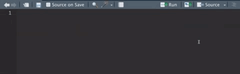
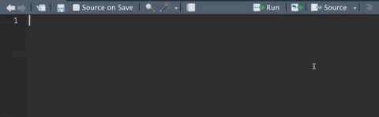

```{r include=FALSE}
knitr::opts_chunk$set(eval = F)
```

# Introduccion

En este laboratorio vamos a modificar la plantilla inicial de shiny para cargar nuestros datos y hacer figuras reactivas.  

Objetivos:

  - Cargar datos en nuestra aplicacion.  
  - Crear objetos reactivos.  
  - visualizar los datos.  
  
-----------------------

Iniciaremos cargando las librerias que vamos a utilizar

```{r Loading libraries}
# Cargar las librerias
library(shiny)
library(dplyr) # Para manipulacion de datos
library(ggplot2) # Para las figuras
```

Ahora cargaremos los datos que usaremos. Asegurate de poner la direccion del archivo correctamente. En el caso de mi proyecto, yo tengo mis datos en una carpeta que se llama *Datos* y quiero cargar el archivo *Vacunacion.csv*.

```{r Loading data}
# Cargar los datos
df <- read.csv('../Datos/Processed/Vacunacion.csv')
```
  
La libreria `shiny` nos proporciona varias funciones para crear nuestra aplicacion. La principal es la funcion `shinyApp`, la cual nos pide dos argumentos `ui` y `server`. En este laboratorio vamos a crear dos objetos que contengan todo lo necesario para ser usados como argumentos en esta funcion. 

# Interfaz (UI)

La interfaz (UI), es donde definimos el tipo de input y outputs que tendra nuestra aplicacion, asi como cualquier otra informacion relevante que nos ayude a explicar la aplicacion. La informacion de nuestra aplicacion estara definida en diferentes niveles anidados con la siguiente jerarquia:  
  
  - Pagina (Page)  
    - Panel  
      - Inputs
      - Outputs
  
Hay diferentes especificaciones para el formato de la Pagina (en este ejercicio usamos `fluidPage()` por ejemplo), y los paneles se pueden organizar en diferentes Layouts. Para esta aplicacion estamos usando el layout `sidebarLayout()`. Para ver que otras opciones de layout tenemos, podemos consultar las funciones llamando la libreria escribiendo `shiny::` (sin cargarla) y usando *tab* para que Rstudio nos muestre la lista de funciones disponibles. Al ir escribiendo la palabra *layout*, la opcion de autocompletar de Rstudio ira reduciendo las opciones a las funciones que contengan la palabra layout en su nombre, por ejemplo:  



Los inputs en shiny los definimos con la funcion correspondiente al tipo de input que queramos introducir. Por ejemplo, si queremos introducir una variable categorica, podemos usar la funcion `selectInput()`, si queremos una variable numerica podemos usar `sliderInput()` o  `numericInput()`. Podemos usar el mismo metodo que usamos para ver los layouts, para buscar todas las funciones en shiny que sean inputs.  



De manera similar, los outputs tienen que ser especificados de acuerdo al tipo de output que queramos, si sera un plot, una tabla, o algun otro tipo de outputs que veremos mas adelante. Para mas informacion sobre los layouts, inputs y outputs, referirse a la documentacion de shiny.

```{r}
# Definir Interfaz
ui <- fluidPage(
    # Titulo de la applicacion
    titlePanel("Nueva aplicacion"),
    # Barra lateral con un input
    sidebarLayout(
      # Panel para los inputs
        sidebarPanel(
          # Input para tipo de granja
          selectInput(inputId = 'tipo', label = 'Tipo :', 
                      choices = unique(df$tipo), multiple = T, 
                      selected = unique(df$tipo))
        ),
        # Panel para los outputs
        mainPanel(
           plotOutput("BarPlot") # Figura de barras
        )
    )
)
```


# Servidor (server)

El servidor (server) debe incluir todos los procesos que ejecutaremos en nuestra aplicacion. 


```{r}
# Definir el servidor
server <- function(input, output) {
  # Objeto reactivo 
  x <- reactive({
        p <- df %>% # base de datos
          filter(tipo %in% input$tipo) # filtramos los datos
      })
  
  # Primer output (grafico de barras)
  output$BarPlot <- renderPlot({
    x() %>% 
      group_by(YEAR, tipo) %>% # agruparlos por año y tipo de explotacion
      summarise(VAC_BOV = sum(VAC_BOV, na.rm = T)) %>%  # sumar los vacunados totales
      ggplot() + # call ggplot
      geom_bar(aes(fill = tipo, y = VAC_BOV, x = factor(YEAR)), # variables para el grafico
               position = 'dodge', stat = 'identity') + # especificar posicion
      theme_minimal() # tema para la figura
    })
}
```


# Corriendo la aplicacion

En el laboratorio anterior corrimos nuestra aplicacion usando el boton de *Run App* que se encuentra en la parte superior derecha de la seccion del editor del codigo, realmente lo que hace este boton es mandar todo el codigo del archivo a la consola. 

```{r}
# Correr la aplicacion
shinyApp(ui = ui, server = server)
```

# Ejercicio


